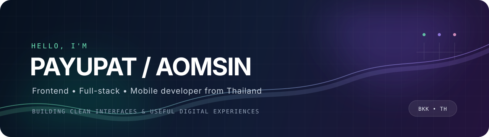

<div align="center">



<br />

<a href="https://github.com/oomsinboy"></a>

<br />

<a href="https://github.com/oomsinboy"></a>
<a href="https://www.linkedin.com/in/payupat"></a>
<a href="https://www.instagram.com/oomsinboy"></a>


</div>

<br />

## `> whoami`

Hello, I'm **Aomsin** — a software developer from **Bangkok, Thailand**. I build interfaces, applications and backend services, using AI as part of my workflow to explore ideas faster and turn them into useful digital experiences.

```ts
const aomsin = {
  role: "Software Developer",
  location: "Bangkok, Thailand",
  workplace: "PLANETCLOUD CO., LTD.",
  focus: ["Frontend", "Full-stack", "Mobile", "AI-assisted development"],
  mindset: "Human creativity + AI acceleration",
};
```

## `// TECH_MATRIX`

<div align="center">


</div>

<p align="center"><sub>React · Next.js · Vue · Node.js · Flutter · Python</sub></p>

<div align="center">


</div>

## `// GITHUB_TELEMETRY`

<div align="center">

<a href="https://github.com/oomsinboy"></a>
<a href="https://github.com/oomsinboy"></a>

<br />

<a href="https://github.com/oomsinboy"></a>

</div>

<br />

<div align="center">


</div>

<div align="center">

## `// ESTABLISH_CONNECTION`

<sub>Have an idea worth building? Send a signal.</sub>

<br />
<br />

<a href="https://www.linkedin.com/in/payupat"></a>

</div>

<br />


